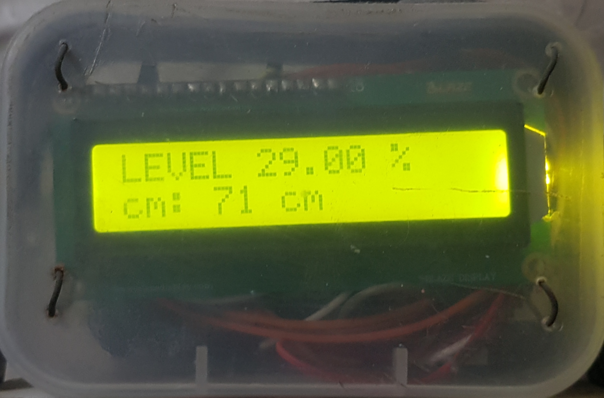

# Water Level Indicator and Alarm

This project is named as Water Level indicator and Alarm.
As depicted by the name, this project is used to indicate water level in tankers and rings a sweet melody when the tank  gets filled completely. It uses a waterproof ultra sonic sensor which uses ultrasonic waves to determine the distance between water and the sensor which indicates the level of water in the tank.

## Usage

## Contributing
Pull requests are welcome. For major changes, please open an issue first to discuss what you would like to change.

Please make sure to update tests as appropriate.

## License
[MIT](https://choosealicense.com/licenses/mit/)
